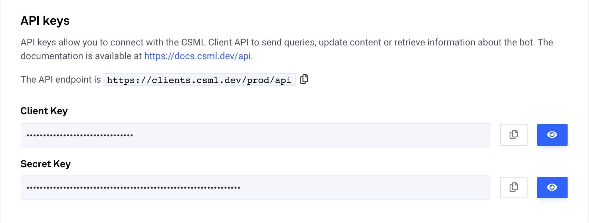

[](#)

# CLI Client for CSML

This CLI client is made to interact with chatbots created on https://studio.csml.dev and exposed through the API connector.

For more information about CSML, please refer to https://docs.csml.dev/#introduction.

## :cloud: Installation

### Clone the repository
```sh
$ git clone git@github.com:bastienbot/CSML-cli-client.git
$ cd CSML-cli-client
```

### Create the CSML API connection
In the CSML studio, create a API connection.
[](#)

Create a new .env based on the existing example
```sh
cp .env.example .env
```
Then copy and paste your credentials in the .env file

## :computer: Usage

```js
$ node main.js "Show me my AWS bill for last month"
```
This will start a conversation with your chatbot sending "Show me my AWS bill for last month" as first message.

### Components
Here are a list of supported components :
- `Text()` is shown as expected
- `Url()` shows the url, your terminal might of might not provide an clicking interface
- `Image()` shows the url, your terminal might of might not provide an clicking interface
- `Wait()` shows the amount is async so the chatbot will not wait, although it will notice you of the instruction
- `Url()` shows the amount is async so the chatbot will not wait, although it will notice you of the instruction
- `Button()` shows a button as text with the option of selecting a button by tyuping its number (1, 2, 3, ...)
- `Question()` shows the question and the buttons shown as buttons components

[](#)


## :sunglasses: Enjoy